 

<picture>
    <source media="(prefers-color-scheme: dark)" srcset="https://raw.githubusercontent.com/guilhermeSales06/guilhermeSales06/output/pacman-contribution-graph-dark.svg">
    <source media="(prefers-color-scheme: light)" srcset="https://raw.githubusercontent.com/guilhermeSales06/guilhermeSales06/output/pacman-contribution-graph.svg">
    
</picture>

